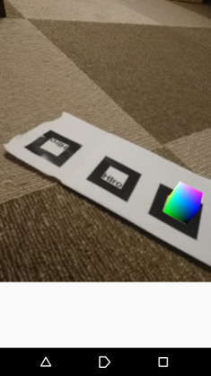

# MyTestARApp

アンドロイド専用の簡単なARアプリです。2018年に作成したものなので、対応環境が古いです。
Android Studio等で該当環境の仮想端末を用意して実行できます.\
時間があれば最新のSDKに対応させます.

## 対応環境
  - Android 7.0 API24
## 開発環境
  - AndroidStudio 3.1.3
  - NyARToolKit for Android-Android 2.2 4.11
## 使い方
1. アプリのダウンロード \ https://github.com/tomsoyaN/MyTestAR_App/blob/master/build/outputs/apk/debug/app-debug.apk?raw=true
2. マーカー画像を用意する \
マーカ―画像→[http://sixwish.jp/resources/NyID/nyid-m2_id001-511.zip](ダウンロードが始まります)
3. アプリを起動する。アクセス許可を求められるので許可をする。 
4. マーカーにカメラを向けるとキューブがマーカーから出てきます。\

## オブジェクトタッチ時のイベント
テストとしてマーカーから出現したオブジェクトをタッチ時にイベントが起こります.
- 音が鳴ります
- 10.0.0.2:80/getText.jsonからテキストを取得し,それを出力します.jsonのタグは"Text"です.
- 10.0.0.2:80/post.phpに"Screen Touched"の文字列を送信します.post.php側の処理で受信したメッセージを表示することができます.

## ソースファイルの大まかな構成
中心的なソースファイルはhttps://github.com/tomsoyaN/MyTestAR_App/tree/master/src/main/java/nyarapp/tom_soya/com/nyarapplication にあります。
- ARActivity.java カメラ初期化,マーカーの検出,オブジェクトの表示,タッチイベント処理など本アプリの中心的処理が記述されています.
- GetAsyncTask.java HTTPのGET通信を行うためのクラスです.
- PostAsyncTask.java HTTPのPOST通信を行うためのクラスです.
